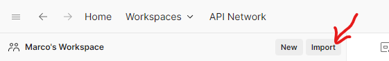

# api-billing-postman
This project has a postman collection that will help you connect to our billing API.

## How to setup Postman Collection

1. Download the following file: `koywe-billing.postman_collection.json`.
2. Now, in your Postman app, go to the import option.

3. Accept the changes and the collection will be enabled, as shown in the image below.

4. Make sure you have your environment variables set like this:

## How to use the APIs in Collection

First, you need to log in to the corresponding environment and you need the credentials.

### Sandbox environment credential

This is the first API in each file.

You already have the Body to send and the API version configured is V1.

You can automatically obtain the access token in a script.

### Select the corresponding API

In this case, I select the current API, as an example.

You get the access token in a variable

Finally, you have the list of all APIs with a generic access token variable, so you can configure it for any country you need.

